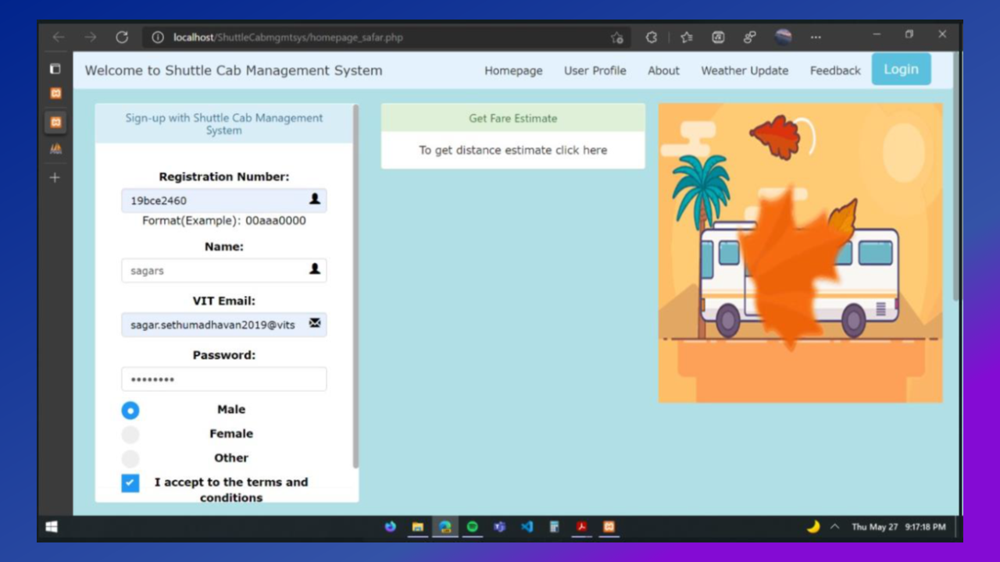

#shuttle Cab Management system

Step to Execute:
1)	Download the zip file.
2)	Extract it and store the folder 'ShuttleCabmgmtsys' in the location path: C:\xampp\htdocs
3)	Open Xampp control panel, and select the start option for Apache and MySql
4)	After few seconds, select the admin option on Apache and mysql.
5)	Create a new database named safar in phpmyadmin
6)	Import the files customer.sql and ride_details.sql inside this database
7)	In the admin site, type localhost/ShuttleCabmgmtsys to view all the files.
8)	Click on homepage_safar.php and visit the complete site starting from there.

Dev softwares: 
1)	Xampp software (for localhost server, phpmyadmin)
2)	Code editors such as VScode, sublime text, notepad++.

